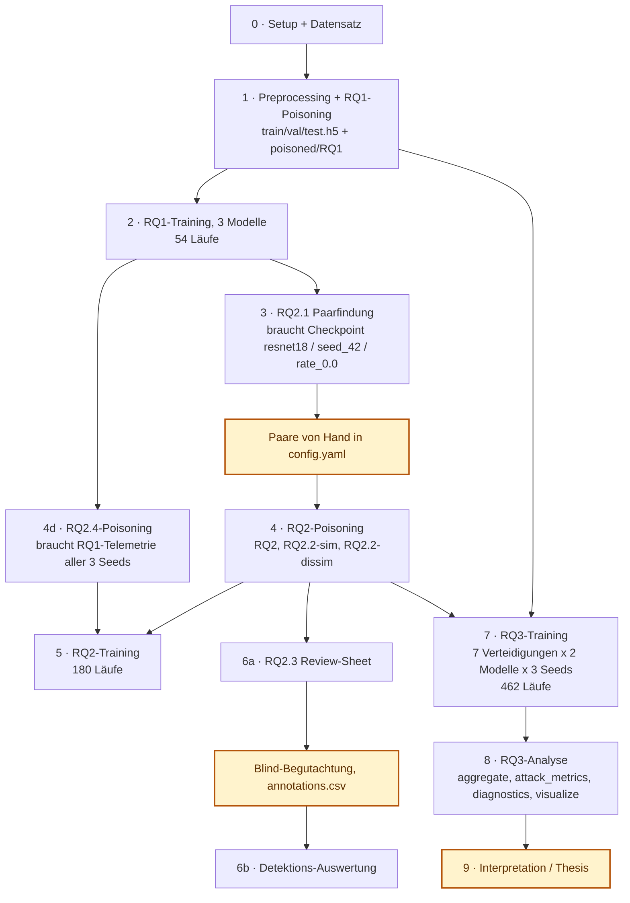

# Robustness of Convolutional Neural Networks against Label-Flipping Attacks

Bachelor Thesis (2026) · University of Bremen · Melih Kaan Yazan


A controlled study of how convolutional neural networks degrade under **label-flipping attacks**,
and of what can be done about it. Images are never touched — only labels are corrupted, in three
progressively more targeted ways, and seven countermeasures are then evaluated against them under
identical conditions.

All experiments run on **NWPU-RESISC45** (remote-sensing scene classification, 45 classes), with
three architectures trained from scratch, three seeds, and a sweep of poisoning rates —
**696 completed training runs** in total.

Ausführungsreihenfolge der kompletten Pipeline: welcher
Befehl wann läuft, was er auf die Platte schreibt, und an welchen Stellen ein Mensch
eingreifen muss, damit es weitergeht.

> [!IMPORTANT]
> Alle Python-Befehle laufen aus dem Ordner [`src/`](src/).

## Inhalt

| | Abschnitt | Inhalt |
|---|---|---|
| | [Abhängigkeiten](#abhängigkeitskette) | Was von was abhängt und warum |
| | [Voraussetzungen](#voraussetzungen) | Software, Hardware, Speicherbedarf, Rechenzeit |
| **A** | [Version A: Reine Konsole](#teil-a-reine-konsole) | Jeder `python -m …` Aufruf in Reihenfolge |
| **B** | [Version B: SLURM](#teil-b-slurm) | Dieselben Schritte als `sbatch`, mit Preflight-Checks |
| | [Lizenz und Zitation](#lizenz-und-zitation) | CC BY-NC 4.0, NWPU-RESISC45 |

### Legende

| Symbol | Bedeutung |
|:---:|---|
Befehl, der ausgeführt wird |
**Manueller Eingriff.** Hier muss ein Mensch etwas tun, sonst geht es nicht weiter |
Kontrollpunkt: was danach auf der Platte liegen muss, bevor weitergemacht wird |
Fallstrick, der stillschweigend falsche Ergebnisse erzeugt |

## Abhängigkeitskette



**Erklärung:**

| Schritt | liest, was Schritt … geschrieben hat |
|---|---|
| 2 | 1 (`*.h5`, `poisoned/RQ1/…`) |
| 3 | 2 (`experiments/RQ1/resnet18/seed_42/rate_0.0/best_model_weights_*.pt`) |
| 4 | Menschlicher Übertrag aus 3 (`poisoning.target_pairs` in `config.yaml`) |
| 4d | 2 (`experiments/RQ1/resnet18/seed_*/rate_0.0/telemetry/sample_telemetry.csv`) |
| 5 | 4 / 4d (`poisoned/RQ2*/…`) |
| 6 | 4 (`poisoned/RQ2/seed_42/labels_0.20.pt`) + `annotations.csv` |
| 7 | 1 und 4 (`poisoned/RQ1/…` **und** `poisoned/RQ2/…`) |
| 8 | 7 (`experiments/RQ3/…`) |

---

## Voraussetzungen

### Software

Python 3.12. Alle Abhängigkeiten sind in [`requirements.txt`](requirements.txt) auf exakte
Versionen gepinnt:

| Paket | Version | Wofür |
|---|---|---|
| `torch` / `torchvision` | 2.5.1 / 0.20.1 | Modelle, Training, Checkpoints |
| `h5py` | 3.16.0 | die HDF5-Splits |
| `numpy` | 2.5.1 | Poisoning-RNG, Metriken |
| `pandas` | 3.0.2 | Telemetrie und alle Ergebnistabellen |
| `scikit-learn` | 1.8.0 | GMM-Filter, AUROC, t-SNE/PCA |
| `matplotlib` / `seaborn` | 3.10.8 / 0.13.2 | Abbildungen und Heatmaps |
| `PyYAML`, `python-dotenv`, `pillow`, `tqdm` | | Configs, `.env`, Bild-IO, Fortschritt |

Keine vortrainierten Gewichte: alle Modelle werden mit `weights=None` instanziiert und
von Grund auf trainiert.

### Hardware

| | Anforderung |
|---|---|
| **GPU** | CUDA-fähig. Die Läufe der Thesis liefen auf einer NVIDIA L40S (48 GB), angefordert per `--gres=gpu:L40S:1`|
| **CPU** | Preprocessing und Poisoning laufen auf der CPU-Partition mit 2 Kernen. Beim Training verlangen die Skripte 8 bis 10 Kerne für die DataLoader-Worker |
| **RAM** | 8 GB für Preprocessing, 16 GB für die Paarfindung (lädt `train.h5` komplett in den Speicher), 32 GB für Training. |

### Speicherbedarf


| Was | Größe | Anmerkung |
|---|---:|---|
| `data/download/` (Rohbilder) | ~ 0,4 GB | 31.500 JPEGs |
| `train.h5` | 3,26 GB | 24.300 × 224 × 224 × 3 als `uint8` |
| `val.h5` / `test.h5` | 362 MB / 605 MB | |
| ein Label-Tensor `labels_*.pt` | 196 KB | 75 Stück über alle RQs, also vernachlässigbar |
| Checkpoint `best_model_weights_*.pt` (resnet18) | 44,9 MB | pro Lauf |
| `model_traced.pt` | 45,0 MB | nur wenn `export.traced_model: true` |
| `sample_telemetry.csv` bei `sample_level: full` | 95,7 MB | 100 Epochen × 24.300 Zeilen pro Lauf |
| Embedding-Plots (PCA/t-SNE, 2D+3D) | ~ 9,8 MB | nur bei den Raten aus `export.embedding_plots` |

Ein vollständiger RQ1-Lauf mit allen Export-Extras belegt damit rund **200 MB**.

Gemessen belegt `experiments/` nach allen 696 Läufen **74 GB**, dazu kommen die 4,2 GB
der HDF5-Splits. Wer die Pipeline komplett neu rechnet, sollte also **rund 80 GB** frei
haben. Nur ein kleiner Teil davon liegt im Repository: Checkpoints, `*.pt`-Dateien

### Rechenzeit

| Job | Limit im Skript | Dokumentierte Laufzeit |
|---|---|---|
| Preprocessing + RQ1-Poisoning | 02:00 h | |
| RQ2 / RQ2.2 Poisoning | 00:30 h | |
| RQ2.4 Poisoning | 01:00 h | |
| RQ2.1 Paarfindung | 01:00 h | |
| Training RQ1 / RQ2 (18 Läufe je Job) | 12:00 h | |
| Training RQ3 (11 Läufe je Array-Task) | 08:00 h, bei `elr` 12:00 h | ca. 4,6 h laut Skript-Ausgabe |
| RQ2.3 Review-Sheet / Auswertung | 00:15 h | |

---

# TEIL A Reine Konsole

Alle Python-Befehle laufen **aus dem Ordner `src/`**. Das Paket hat keine
Editable-Installation und kein eigenes `sys.path`-Handling `implementation.<modul>`
löst sich nur auf, wenn `src/` das Arbeitsverzeichnis ist.

`--data-config` ist überall optional und fällt auf
`src/implementation/data_preparation/config.yaml` zurück. Unten ist es der Klarheit
halber weggelassen. In den SLURM-Skripten steht es explizit.

---

## Schritt 0 Setup (einmalig, Mensch)

**0.1 Umgebung anlegen**

```bash
python -m venv .venv
source .venv/bin/activate          # Windows: .venv\Scripts\activate
pip install -r requirements.txt
```

Python 3.12, für Training eine CUDA-fähige GPU

**0.2 `.env` prüfen** (liegt im Root, wird von `implementation.shared.env`
beim Import jedes Einstiegspunkts geladen):

```
PYTORCH_CUDA_ALLOC_CONF=expandable_segments:False
PYTORCH_NVML_BASED_CUDA_CHECK=0
MPLBACKEND=Agg
```

Hier gehören nur Maschinen-Variablen hinein, keine Forschungsparameter.

**0.3 Datensatz besorgen und ablegen.** NWPU-RESISC45 wird nicht mitgeliefert und
muss separat von den Autoren bezogen werden. Erwartet wird die Original-Aufteilung des
Benchmarks, Klassenordner **eine Ebene tiefer** als der Split-Ordner:

```
data/download/
├── train/train/<class_name>/*.jpg      45 Klassen × 600 Bilder
└── test/test/<class_name>/*.jpg        45 Klassen × 100 Bilder
```

`data/download/train/train/` und `data/download/test/test/` enthalten je 45 Ordner.

---

## Schritt 1 Preprocessing + RQ1-Poisoning


```bash
cd src
python -m implementation.run_pipeline --config yaml/preparation/rq1_data_preparation.yaml
```

Ein Befehl für zwei Phasen: `run_pipeline` konvertiert erst die JPEGs nach HDF5 und
vergiftet dann die Labels. Welcher Poisoner läuft, entscheidet `experiment.rq` in der
YAML hier `RQ1` → `SymmetricPoisoner`.

Preprocessing wird übersprungen, wenn alle drei `.h5` schon existieren
(`preprocessing.skip_if_exists: true`). Ein erzwungener Neulauf geht nur über
`skip_if_exists: false` in `data_preparation/config.yaml`.

Danach müssen existieren:

```
data/processed/resisc45/{train,val,test}.h5           # 24.300 / 2.700 / 4.500 Bilder
data/processed/resisc45/poisoned/RQ1/seed_{42,2001,2026}/labels_{0.01,0.02,0.05,0.10,0.20}.pt
```

Das sind **3 HDF5-Dateien + 15 Label-Tensoren**. Rate 0.0 braucht keine Datei der
Loader lädt dort die saubere Ground-Truth aus der HDF5.

---

## Schritt 2 RQ1-Training (54 Läufe)

Drei Modelle, jeweils 3 Seeds × 6 Raten. `resnet18` und `mobilenetv2` haben **eine**
YAML mit allen drei Seeds, `convnext_tiny` hat **drei** YAMLs (eine pro Seed), weil ein
Lauf sonst das Zeitlimit sprengt.


```bash
python -m implementation.shared.training.run --config yaml/rq1/rq1_train_resnet18.yaml
python -m implementation.shared.training.run --config yaml/rq1/rq1_train_mobilenetv2.yaml
python -m implementation.shared.training.run --config yaml/rq1/rq1_train_convnext_tiny_seed42.yaml
python -m implementation.shared.training.run --config yaml/rq1/rq1_train_convnext_tiny_seed2001.yaml
python -m implementation.shared.training.run --config yaml/rq1/rq1_train_convnext_tiny_seed2026.yaml
```


```bash
python -m implementation.shared.training.run --config yaml/rq1/rq1_train_resnet18.yaml --seed 42
```

`experiments/RQ1/{resnet18,mobilenetv2,convnext_tiny}/seed_*/rate_*/` 18 Läufe pro
Modell, 54 insgesamt. Pro Modell eine `summary_metrics.csv` eine Ebene über `seed_*`.

**Wichtig für später:** Aus diesem Schritt brauchen die nächsten beiden zwingend

- `experiments/RQ1/resnet18/seed_42/rate_0.0/best_model_weights_rate_0.00_epoch_*.pt` → Schritt 3
- `experiments/RQ1/resnet18/seed_{42,2001,2026}/rate_0.0/telemetry/sample_telemetry.csv` → Schritt 4d

---

## Schritt 3 RQ2.1: Klassenpaare finden


```bash
python -m implementation.rq2.rq2_1.discover_pairs --config yaml/preparation/rq2_1_discover_pairs.yaml
```

Lädt den sauberen Baseline-Checkpoint (resnet18, Seed 42, Rate 0.0), berechnet
Klassen-Prototypen im Feature-Raum, deren paarweise Kosinus-Ähnlichkeit, einen
Schwellenwert aus dem 90. Perzentil und macht daraus per Greedy-Matching eindeutige
Paare.

`src/implementation/rq2/artifacts/discovered_target_pairs.json`

### MANUELLER EINGRIFF 1 Paare übertragen

**Das JSON wird von keinem anderen Skript gelesen.** Es ist ein Bericht. Die Paare
müssen von Hand nach `src/implementation/data_preparation/config.yaml` übertragen
werden:

1. `poisoning.target_pairs` ← die Liste unter `"pairs"` aus dem JSON
   (16 Paare, absteigend nach `cosine_similarity`).
2. `rq2_2.sim_pair` ← das **ähnlichste** Paar (erster Eintrag), aktuell `[7, 27]`
   (church ↔ palace, cos_sim 0.717).
3. `rq2_2.dissim_pair` ← das Kontrollpaar, aktuell `[12, 26]` (desert ↔ overpass).

Die Kommentarblöcke in der `config.yaml` (Klassen-Index-Mapping und die
cos_sim-Tabelle) sinnvollerweise mitpflegen sie sind die einzige Dokumentation,
welche Zahl welche Klasse ist.

Achtung!: Wer diesen Schritt überspringt, vergiftet in Schritt 4 mit den **alten** Paaren.
Die bereits eingetragenen 16 Paare gehören zu den eingefrorenen Ergebnissen wenn die
vorhandenen 696 Läufe reproduziert werden sollen, bleibt die Datei unverändert und
`discover_pairs` dient nur der Bestätigung.

---

## Schritt 4 RQ2-Poisoning

Drei unabhängige Läufe, Reihenfolge untereinander egal. Alle brauchen nur `train.h5`
und die aktualisierte `config.yaml`.

```bash
python -m implementation.run_pipeline --config yaml/preparation/rq2_data_preparation.yaml
python -m implementation.run_pipeline --config yaml/preparation/rq2_2_sim_data_preparation.yaml
python -m implementation.run_pipeline --config yaml/preparation/rq2_2_dissim_data_preparation.yaml
```

je 3 Seeds × 5 Raten = 15 Tensoren pro Variante:

```
data/processed/resisc45/poisoned/RQ2/seed_*/labels_{0.01,0.02,0.05,0.10,0.20}.pt
data/processed/resisc45/poisoned/RQ2.2-sim/seed_*/labels_{0.05,0.10,0.20,0.50,1.00}.pt
data/processed/resisc45/poisoned/RQ2.2-dissim/seed_*/labels_{0.05,0.10,0.20,0.50,1.00}.pt
```

Dazu pro Ordner `transition_matrix_*.json` und `heatmap_*.pdf` als Verifikation.

### Schritt 4d RQ2.4-Poisoning (erst nach Schritt 2!)

```bash
python -m implementation.run_pipeline --config yaml/preparation/rq2_4_data_preparation.yaml
```

Kein Rate-Sweep: dieser Angriff liest die **Trainings-Telemetrie** des sauberen
RQ1-Baseline-Modells (resnet18) aus den Epochen 25-49 und flippt jedes Sample auf die
mehrheitlich vorhergesagte Klasse, sofern die Konfidenz über 0.5 liegt. Die erreichte
Rate ergibt sich, sie wird nicht vorgegeben.

```
data/processed/resisc45/poisoned/RQ2.4/seed_{42,2001,2026}/labels.pt   ← Sentinel-Name ohne Rate
                                                          /transition_matrix.json
                                                          /heatmap.pdf
                                                          /poisoning_summary.json
```

## Schritt 5 RQ2-Training (180 Läufe)

Vier Varianten × 3 Modelle. Untereinander unabhängig, brauchen aber alle die Labels aus
Schritt 4/4d.

**RQ2.1** (3 Seeds × 6 Raten = 54 Läufe)

```bash
python -m implementation.shared.training.run --config yaml/rq2/rq2_1/rq2_1_train_resnet18.yaml
python -m implementation.shared.training.run --config yaml/rq2/rq2_1/rq2_1_train_mobilenetv2.yaml
python -m implementation.shared.training.run --config yaml/rq2/rq2_1/rq2_1_train_convnext_tiny_seed42.yaml
python -m implementation.shared.training.run --config yaml/rq2/rq2_1/rq2_1_train_convnext_tiny_seed2001.yaml
python -m implementation.shared.training.run --config yaml/rq2/rq2_1/rq2_1_train_convnext_tiny_seed2026.yaml
```

**RQ2.2-sim** (54 Läufe, Raten 0.0/0.05/0.1/0.2/0.5/1.0)

```bash
python -m implementation.shared.training.run --config yaml/rq2/rq2_2_sim/rq2_2_sim_train_resnet18.yaml
python -m implementation.shared.training.run --config yaml/rq2/rq2_2_sim/rq2_2_sim_train_mobilenetv2.yaml
python -m implementation.shared.training.run --config yaml/rq2/rq2_2_sim/rq2_2_sim_train_convnext_tiny_seed42.yaml
python -m implementation.shared.training.run --config yaml/rq2/rq2_2_sim/rq2_2_sim_train_convnext_tiny_seed2001.yaml
python -m implementation.shared.training.run --config yaml/rq2/rq2_2_sim/rq2_2_sim_train_convnext_tiny_seed2026.yaml
```

**RQ2.2-dissim** (54 Läufe)

```bash
python -m implementation.shared.training.run --config yaml/rq2/rq2_2_dissim/rq2_2_dissim_train_resnet18.yaml
python -m implementation.shared.training.run --config yaml/rq2/rq2_2_dissim/rq2_2_dissim_train_mobilenetv2.yaml
python -m implementation.shared.training.run --config yaml/rq2/rq2_2_dissim/rq2_2_dissim_train_convnext_tiny_seed42.yaml
python -m implementation.shared.training.run --config yaml/rq2/rq2_2_dissim/rq2_2_dissim_train_convnext_tiny_seed2001.yaml
python -m implementation.shared.training.run --config yaml/rq2/rq2_2_dissim/rq2_2_dissim_train_convnext_tiny_seed2026.yaml
```

**RQ2.4** (3 Seeds × 2 Raten = 18 Läufe; Rate 0.0 = sauber, Rate 1.0 = die
Telemetrie-Labels)

```bash
python -m implementation.shared.training.run --config yaml/rq2/rq2_4/rq2_4_train_resnet18.yaml
python -m implementation.shared.training.run --config yaml/rq2/rq2_4/rq2_4_train_mobilenetv2.yaml
python -m implementation.shared.training.run --config yaml/rq2/rq2_4/rq2_4_train_convnext_tiny.yaml
```

`experiments/{RQ2,RQ2.2-sim,RQ2.2-dissim,RQ2.4}/{model}/seed_*/rate_*/`

---

## Schritt 6 RQ2.3: Blindstudie mit Menschen

**6a Review-Sheet bauen** (braucht `poisoned/RQ2/seed_42/labels_0.20.pt` aus Schritt 4)

```bash
python -m implementation.rq2.rq2_3.build_review_sheet --config yaml/rq2/rq2_3/rq2_3_review.yaml
```

Zieht 50 vergiftete und 50 saubere Bilder aus dem RQ2-Sweep bei Rate 0.20, mischt sie
und schreibt sie durchnummeriert weg.

```
human_review/images/0000.png … 0099.png
human_review/review.csv       # id,assigned_label   → für die Gutachter
human_review/key.csv          # Lösungsschlüssel    → NICHT den Gutachtern zeigen
```

### MANUELLER EINGRIFF 2 Begutachtung

1. `human_review/key.csv` **wegsperren**, den Gutachtern nur `images/` und `review.csv`
   geben.
2. Jedes Bild ansehen und entscheiden: passt das zugewiesene Label zum Bild oder nicht?
3. Ergebnis als `human_review/annotations.csv` ablegen. Die Auswertung braucht
   mindestens die Spalten **`id`** und **`flagged`** (`flagged` = 1, wenn das Label als
   falsch markiert wurde, sonst 0). Die vorhandene Datei führt zusätzlich `image` und
   `assigned_label` mit das stört nicht, die Auswertung ignoriert Zusatzspalten.

```csv
id,image,assigned_label,flagged
0,images/0000.png,golf_course,0
1,images/0001.png,industrial_area,0
```

**6b Auswertung**

```bash
python -m implementation.rq2.rq2_3.evaluate_detection
```

Nimmt keine Argumente die Pfade sind fest `human_review/key.csv` und
`human_review/annotations.csv`. Gibt Detection Rate (Anteil gefundener Vergiftungen)
und False-Positive-Rate (Fehlalarme auf sauberen Bildern) auf der Konsole aus.

**Kontrolle:** Die beiden Zahlen abschreiben sie werden nirgendwo in eine Datei
geschrieben.

---

## Schritt 7 RQ3-Training (462 Läufe)

RQ3 erzeugt **keine** eigenen Labels. Es trainiert gegen die schon vorhandenen
RQ1- und RQ2-Labeltensoren und variiert stattdessen die Verteidigung. Beide Label-Sätze
(Schritt 1 **und** Schritt 4) müssen also vollständig da sein.

Die Verteidigung ist ein **CLI-Override**, kein Config-Wert. Deshalb reichen zwei YAMLs
(eine pro Modell) für alle 14. Jeder Lauf deckt `attacks: [clean, RQ1, RQ2]` ab, das
sind 1 clean + 2 × 5 Raten = **11 Läufe pro (Verteidigung, Modell, Seed)**.

7 Verteidigungen × 2 Modelle × 3 Seeds = **42 Aufrufe**, jeder einzeln aufgeführt.
Reihenfolge: `none` zuerst (Referenzarm), dann die vier präventiven, dann die zwei
reaktiven Verteidigungen.

**1 `none` (NullDefense, Referenz 6 Aufrufe)**

```bash
python -m implementation.shared.training.run --config yaml/rq3/rq3_train_resnet18.yaml --defense none --seed 42
python -m implementation.shared.training.run --config yaml/rq3/rq3_train_resnet18.yaml --defense none --seed 2001
python -m implementation.shared.training.run --config yaml/rq3/rq3_train_resnet18.yaml --defense none --seed 2026
python -m implementation.shared.training.run --config yaml/rq3/rq3_train_mobilenetv2.yaml --defense none --seed 42
python -m implementation.shared.training.run --config yaml/rq3/rq3_train_mobilenetv2.yaml --defense none --seed 2001
python -m implementation.shared.training.run --config yaml/rq3/rq3_train_mobilenetv2.yaml --defense none --seed 2026
```

**2 `label_smoothing` (präventiv 6 Aufrufe)**

```bash
python -m implementation.shared.training.run --config yaml/rq3/rq3_train_resnet18.yaml --defense label_smoothing --seed 42
python -m implementation.shared.training.run --config yaml/rq3/rq3_train_resnet18.yaml --defense label_smoothing --seed 2001
python -m implementation.shared.training.run --config yaml/rq3/rq3_train_resnet18.yaml --defense label_smoothing --seed 2026
python -m implementation.shared.training.run --config yaml/rq3/rq3_train_mobilenetv2.yaml --defense label_smoothing --seed 42
python -m implementation.shared.training.run --config yaml/rq3/rq3_train_mobilenetv2.yaml --defense label_smoothing --seed 2001
python -m implementation.shared.training.run --config yaml/rq3/rq3_train_mobilenetv2.yaml --defense label_smoothing --seed 2026
```

**3 `mixup` (präventiv 6 Aufrufe)**

```bash
python -m implementation.shared.training.run --config yaml/rq3/rq3_train_resnet18.yaml --defense mixup --seed 42
python -m implementation.shared.training.run --config yaml/rq3/rq3_train_resnet18.yaml --defense mixup --seed 2001
python -m implementation.shared.training.run --config yaml/rq3/rq3_train_resnet18.yaml --defense mixup --seed 2026
python -m implementation.shared.training.run --config yaml/rq3/rq3_train_mobilenetv2.yaml --defense mixup --seed 42
python -m implementation.shared.training.run --config yaml/rq3/rq3_train_mobilenetv2.yaml --defense mixup --seed 2001
python -m implementation.shared.training.run --config yaml/rq3/rq3_train_mobilenetv2.yaml --defense mixup --seed 2026
```

**4 `gce` (präventiv 6 Aufrufe)**

```bash
python -m implementation.shared.training.run --config yaml/rq3/rq3_train_resnet18.yaml --defense gce --seed 42
python -m implementation.shared.training.run --config yaml/rq3/rq3_train_resnet18.yaml --defense gce --seed 2001
python -m implementation.shared.training.run --config yaml/rq3/rq3_train_resnet18.yaml --defense gce --seed 2026
python -m implementation.shared.training.run --config yaml/rq3/rq3_train_mobilenetv2.yaml --defense gce --seed 42
python -m implementation.shared.training.run --config yaml/rq3/rq3_train_mobilenetv2.yaml --defense gce --seed 2001
python -m implementation.shared.training.run --config yaml/rq3/rq3_train_mobilenetv2.yaml --defense gce --seed 2026
```

**5 `elr` (präventiv 6 Aufrufe)**

```bash
python -m implementation.shared.training.run --config yaml/rq3/rq3_train_resnet18.yaml --defense elr --seed 42
python -m implementation.shared.training.run --config yaml/rq3/rq3_train_resnet18.yaml --defense elr --seed 2001
python -m implementation.shared.training.run --config yaml/rq3/rq3_train_resnet18.yaml --defense elr --seed 2026
python -m implementation.shared.training.run --config yaml/rq3/rq3_train_mobilenetv2.yaml --defense elr --seed 42
python -m implementation.shared.training.run --config yaml/rq3/rq3_train_mobilenetv2.yaml --defense elr --seed 2001
python -m implementation.shared.training.run --config yaml/rq3/rq3_train_mobilenetv2.yaml --defense elr --seed 2026
```

**6 `small_loss` (reaktiv 6 Aufrufe)**

```bash
python -m implementation.shared.training.run --config yaml/rq3/rq3_train_resnet18.yaml --defense small_loss --seed 42
python -m implementation.shared.training.run --config yaml/rq3/rq3_train_resnet18.yaml --defense small_loss --seed 2001
python -m implementation.shared.training.run --config yaml/rq3/rq3_train_resnet18.yaml --defense small_loss --seed 2026
python -m implementation.shared.training.run --config yaml/rq3/rq3_train_mobilenetv2.yaml --defense small_loss --seed 42
python -m implementation.shared.training.run --config yaml/rq3/rq3_train_mobilenetv2.yaml --defense small_loss --seed 2001
python -m implementation.shared.training.run --config yaml/rq3/rq3_train_mobilenetv2.yaml --defense small_loss --seed 2026
```

**7 `gmm_filter` (reaktiv 6 Aufrufe)**

```bash
python -m implementation.shared.training.run --config yaml/rq3/rq3_train_resnet18.yaml --defense gmm_filter --seed 42
python -m implementation.shared.training.run --config yaml/rq3/rq3_train_resnet18.yaml --defense gmm_filter --seed 2001
python -m implementation.shared.training.run --config yaml/rq3/rq3_train_resnet18.yaml --defense gmm_filter --seed 2026
python -m implementation.shared.training.run --config yaml/rq3/rq3_train_mobilenetv2.yaml --defense gmm_filter --seed 42
python -m implementation.shared.training.run --config yaml/rq3/rq3_train_mobilenetv2.yaml --defense gmm_filter --seed 2001
python -m implementation.shared.training.run --config yaml/rq3/rq3_train_mobilenetv2.yaml --defense gmm_filter --seed 2026
```

Gültige Werte für `--defense`: `none`, `label_smoothing`, `mixup`, `gce`, `elr`,
`small_loss`, `gmm_filter`. `none` ist der NullDefense-Arm die Referenz, gegen die
alle anderen verglichen werden, und gleichzeitig der Nachweis, dass der Trainingspfad
unverändert geblieben ist. **`none` also nicht weglassen.**

`--seed` überschreibt die Seed-Liste aus der YAML durch genau diesen einen Seed. Ohne
`--seed` läuft ein einziger Aufruf alle drei Seeds nacheinander ab dann wären es 14
statt 42 Aufrufe, aber je 33 Läufe am Stück statt 11. Die 42er-Aufteilung ist die, die
auch die SLURM-Arrays in Teil B verwenden.

Es gibt in RQ3 **kein `convnext_tiny`** nur `resnet18` und `mobilenetv2`.

`experiments/RQ3/{defense}/{model}/{clean,RQ1,RQ2}/seed_*/rate_*/` pro Arm eine `summary_metrics.csv`.

---

## Schritt 8 RQ3-Analyse

Reihenfolge zählt: `visualize` ist das einzige Modul, das von den anderen abhängt und
läuft **zuletzt**. `aggregate`, `attack_metrics` und `diagnostics` sind untereinander
unabhängig.

```bash
python -m implementation.rq3.aggregate                    # rq3_master.csv, rq3_cells.csv, rq3_wilcoxon.csv
python -m implementation.rq3.attack_metrics               # rq3_attack_metrics.csv, rq3_attack_cells.csv
python -m implementation.rq3.diagnostics                  # diagnostics/{epoch_metrics_all,separability,filter_quality,memorization}.csv
python -m implementation.rq3.diagnostics --legacy RQ1 RQ2 # zusätzlich: Separabilität aus den RQ1/RQ2-Läufen rekonstruiert
python -m implementation.rq3.visualize                    # die fünf Abbildungen ZULETZT
```

Ein fehlendes Eingangs-CSV lässt `visualize` nicht abbrechen es überspringt nur die
betroffene Abbildung. Wenn eine Figur fehlt, ist meist `aggregate` oder `diagnostics`
noch nicht gelaufen.

`experiments/RQ3/*.csv`, `experiments/RQ3/diagnostics/*.csv`,
`experiments/RQ3/figures/*`

---

## Schritt 9 Auswertung

Nichts mehr auszuführen. Zu tun:

- `experiments/RQ3/rq3_cells.csv` und `rq3_wilcoxon.csv` lesen: welche Verteidigung
  gewinnt bei welchem Modell/Angriff, und ist der Unterschied signifikant?
- `rq3_attack_cells.csv`: Angriffserfolg **und** Kollateralschaden getrennt betrachten
  eine Verteidigung, die den Angriffserfolg nur senkt, indem sie das Modell insgesamt
  verschlechtert, ist kein Erfolg.
- Die fünf Abbildungen aus `figures/` in die Thesis übernehmen.

---

# TEIL B SLURM

25 Batch-Skripte unter `slurm/`, eines pro Config. Jedes Skript kapselt die
Ressourcenanforderung, die Conda-Aktivierung, einen **Preflight-Check** (existieren die
HDF5-Splits und Label-Tensoren, die dieser Lauf braucht?) und eine Ergebnisübersicht am
Ende. Fehlt eine Voraussetzung, bricht das Skript **vor** der Allokation der GPU ab.

Logs landen jeweils in `slurm/<bereich>/logs/`.

---

## Schritt 0 Setup auf dem Cluster (Mensch, einmalig)

**0.1 Pfade in den Skripten prüfen.** Alle 25 Skripte haben zwei fest verdrahtete
Pfade:

```bash
REPO_ROOT="/home/$USER/BachelorThesis/BachelorThesis"
source /home/$USER/miniforge3/etc/profile.d/conda.sh
conda activate /home/$USER/miniforge3/envs/venv/
```

Bei einem anderen Account/Cluster müssen beide angepasst werden inklusive der
absoluten `#SBATCH --output`/`--error`-Pfade im Header, sonst startet der Job nicht.

**0.2 Partitionen und GPU-Typ prüfen.** Die Skripte fordern `--partition=CPU` bzw.
`--partition=GPU` an; ein Teil verlangt explizit `--gres=gpu:L40S:1`, ein anderer nur
`--gres=gpu`. Bei fehlendem L40S-Typ die Zeile auf `--gres=gpu:1` ändern.

**0.3 Conda-Env und Datensatz** wie in Teil A, Schritt 0 (`requirements.txt`,
`.env`, `data/download/`).

**0.4 Log-Ordner** müssen existieren (`slurm/preparation/logs`, `slurm/rq1/logs`,
`slurm/rq2/rq2_*/logs`, `slurm/rq3/logs`). SLURM legt sie nicht selbst an.

Nützliche Kommandos für alle folgenden Schritte:

```bash
squeue -u $USER                       # was läuft/wartet gerade
sacct -j <jobid> --format=JobID,JobName,State,Elapsed,ExitCode
tail -f slurm/<bereich>/logs/<name>_<jobid>.log
scancel <jobid>
```

---

## Schritt 1 Preprocessing + RQ1-Poisoning

```bash
sbatch slurm/preparation/rq1_data_preparation.sh
```

CPU-Partition, 2 h Limit, 8 GB. Log: `slurm/preparation/logs/rq1_dataprep_<jobid>.log`

Das Skript listet am Ende selbst die erzeugten HDF5-Splits und zählt die
Label-Tensoren (**erwartet: 15**). Diese Zahl im Log kontrollieren, bevor Schritt 2
abgeschickt wird.

---

## Schritt 2 RQ1-Training

Drei Skripte. Zwei davon trainieren alle drei Seeds nacheinander in **einem** Job,
`convnext_tiny` ist ein **Array-Job** über die Seeds.

```bash
sbatch slurm/rq1/rq1_train_resnet18.sh          # 1 Job,  3 Seeds × 6 Raten = 18 Läufe
sbatch slurm/rq1/rq1_train_mobilenetv2.sh       # 1 Job,  18 Läufe
sbatch slurm/rq1/rq1_train_convnext_tiny.sh     # Array 0-2, ein Seed je Task
```

Der Array-Task-Index wählt den Seed (`SEEDS=(42 2001 2026)`) und damit die passende
`rq1_train_convnext_tiny_seed<SEED>.yaml`.

Alle drei GPU, 12 h Limit. Können parallel abgeschickt werden.

Preflight in jedem Skript: 3 HDF5-Splits + die 15 (bzw. 5 pro Array-Task) RQ1-Label-Dateien.

Logs: `slurm/rq1/logs/`. Jedes Skript zählt am Ende die abgeschlossenen `rate_*`-Ordner
(**erwartet: 18 je Modell, bzw. 6 je Array-Task**) und gibt bei `resnet18` zusätzlich die
`summary_metrics.csv` aus.

**Warten, bis mindestens `rq1_train_resnet18` komplett durch ist** Schritt 3 und 4d
hängen an dessen Checkpoint bzw. Telemetrie.

---

## Schritt 3 RQ2.1 Paarfindung

```bash
sbatch slurm/preparation/rq2_1_discover_pairs.sh
```

GPU (braucht das Modell für die Feature-Extraktion), 1 h Limit.

Preflight: `train.h5` **und** ein Checkpoint unter
`experiments/RQ1/resnet18/seed_42/rate_0.0/best_model_weights_rate_0.00_epoch_*.pt`.
Fehlt er, bricht das Skript mit dem Hinweis ab, erst `rq1_train_resnet18` laufen zu lassen.

`src/implementation/rq2/artifacts/discovered_target_pairs.json`
Log: `slurm/preparation/logs/rq2_1_discover_pairs_<jobid>.log`

### MANUELLER EINGRIFF 1 identisch zu Teil A, Schritt 3

Das Skript sagt es am Ende selbst:

> HINWEIS: `poisoning.target_pairs` in `data_preparation/config.yaml` wird NICHT
> automatisch aktualisiert. Abweichungen von Hand übertragen und danach
> `rq2_data_preparation` neu laufen lassen.

Also: JSON öffnen, `pairs` nach `poisoning.target_pairs` übertragen, `rq2_2.sim_pair` /
`rq2_2.dissim_pair` prüfen **erst dann** Schritt 4 abschicken.

---

## Schritt 4 RQ2-Poisoning

Die drei können gleichzeitig abgeschickt werden:

```bash
sbatch slurm/preparation/rq2_data_preparation.sh            # RQ2.1        → 15 Tensoren
sbatch slurm/preparation/rq2_2_sim_data_preparation.sh      # RQ2.2-sim    → 15 Tensoren
sbatch slurm/preparation/rq2_2_dissim_data_preparation.sh   # RQ2.2-dissim → 15 Tensoren
```

Alle drei: GPU-Partition, 30 min Limit. Preflight: die drei HDF5-Splits.

Jedes Skript listet am Ende die erzeugten `labels_*.pt` und zählt sie
(**erwartet: je 15**).

### Schritt 4d RQ2.4-Poisoning

```bash
sbatch slurm/preparation/rq2_4_data_preparation.sh
```

CPU-Partition, 1 h. Preflight: `train.h5` **und** `sample_telemetry.csv` für **alle drei
Seeds** unter `experiments/RQ1/resnet18/seed_*/rate_0.0/telemetry/`. Darf also erst nach
dem vollständigen Durchlauf von `rq1_train_resnet18.sh` starten.

Das Skript gibt am Ende die drei `labels.pt` **und den Inhalt jeder
`poisoning_summary.json`** aus dort steht die tatsächlich erreichte
Vergiftungsrate. Diese Werte notieren.

---

## Schritt 5 RQ2-Training

12 Skripte. Innerhalb einer Variante unabhängig, alle brauchen Schritt 4 bzw. 4d.

**RQ2.1**

```bash
sbatch slurm/rq2/rq2_1/rq2_1_train_resnet18.sh          # 1 Job, 18 Läufe
sbatch slurm/rq2/rq2_1/rq2_1_train_mobilenetv2.sh       # 1 Job, 18 Läufe
sbatch slurm/rq2/rq2_1/rq2_1_train_convnext_tiny.sh     # Array 0-2
```

**RQ2.2-sim**

```bash
sbatch slurm/rq2/rq2_2_sim/rq2_2_sim_train_resnet18.sh
sbatch slurm/rq2/rq2_2_sim/rq2_2_sim_train_mobilenetv2.sh
sbatch slurm/rq2/rq2_2_sim/rq2_2_sim_train_convnext_tiny.sh     # Array 0-2
```

**RQ2.2-dissim**

```bash
sbatch slurm/rq2/rq2_2_dissim/rq2_2_dissim_train_resnet18.sh
sbatch slurm/rq2/rq2_2_dissim/rq2_2_dissim_train_mobilenetv2.sh
sbatch slurm/rq2/rq2_2_dissim/rq2_2_dissim_train_convnext_tiny.sh  # Array 0-2
```

**RQ2.4** (kein Array, auch bei convnext nur 2 Raten pro Seed)

```bash
sbatch slurm/rq2/rq2_4/rq2_4_train_resnet18.sh
sbatch slurm/rq2/rq2_4/rq2_4_train_mobilenetv2.sh
sbatch slurm/rq2/rq2_4/rq2_4_train_convnext_tiny.sh
```

Preflight jeweils: 3 HDF5-Splits + die 15 Label-Tensoren der jeweiligen Variante
(bei RQ2.4: die drei `labels.pt`).

Logs unter `slurm/rq2/<variante>/logs/`.

---

## Schritt 6 RQ2.3 Blindstudie

**6a**

```bash
sbatch slurm/rq2/rq2_3/rq2_3_build_review_sheet.sh
```

CPU, 15 min. Preflight: `train.h5` + `poisoned/RQ2/seed_42/labels_0.20.pt`.

Das Skript listet `human_review/` auf, zählt die PNGs und schreibt ins Log:

> NAECHSTER SCHRITT (manuell): `review.csv` + `images/` begutachten und eine
> `annotations.csv` mit den Spalten `id,flagged` in `human_review/` ablegen.

### MANUELLER EINGRIFF 2 Begutachtung

Läuft **außerhalb von SLURM**. `human_review/images/` und `review.csv` vom Cluster
herunterladen, begutachten, `annotations.csv` erstellen und wieder nach
`human_review/` auf dem Cluster hochladen. `key.csv` dabei nicht an die Gutachter geben.

**6b** erst wenn `annotations.csv` auf dem Cluster liegt:

```bash
sbatch slurm/rq2/rq2_3/rq2_3_evaluate_detection.sh
```

Preflight: `key.csv` **und** `annotations.csv`. Fehlt letztere, sagt das Skript
ausdrücklich, dass sie von Hand erstellt werden muss.

Ergebnis steht **nur im Log**
(`slurm/rq2/rq2_3/logs/rq2_3_evaluate_<jobid>.log`) Detection Rate und
False-Positive-Rate von dort abschreiben.

---

## Schritt 7 RQ3-Training

14 Skripte (7 Verteidigungen × 2 Modelle), jedes ein **Array 0-2** über die Seeds
→ 42 Tasks, je 11 Läufe = 462. Kein `convnext_tiny` in RQ3.

```bash
# resnet18
sbatch slurm/rq3/rq3_none_resnet18.sh
sbatch slurm/rq3/rq3_label_smoothing_resnet18.sh
sbatch slurm/rq3/rq3_mixup_resnet18.sh
sbatch slurm/rq3/rq3_gce_resnet18.sh
sbatch slurm/rq3/rq3_elr_resnet18.sh
sbatch slurm/rq3/rq3_small_loss_resnet18.sh
sbatch slurm/rq3/rq3_gmm_filter_resnet18.sh

# mobilenetv2
sbatch slurm/rq3/rq3_none_mobilenetv2.sh
sbatch slurm/rq3/rq3_label_smoothing_mobilenetv2.sh
sbatch slurm/rq3/rq3_mixup_mobilenetv2.sh
sbatch slurm/rq3/rq3_gce_mobilenetv2.sh
sbatch slurm/rq3/rq3_elr_mobilenetv2.sh
sbatch slurm/rq3/rq3_small_loss_mobilenetv2.sh
sbatch slurm/rq3/rq3_gmm_filter_mobilenetv2.sh
```

Jedes Skript setzt intern `MODEL` und `DEFENSE` und ruft

```bash
python -m implementation.shared.training.run --config … --data-config … --defense ${DEFENSE} --seed ${SEED}
```

Preflight: 3 HDF5-Splits + **10** Label-Tensoren pro Seed (5 aus RQ1 **und** 5 aus RQ2).
RQ3 hängt also an Schritt 1 *und* Schritt 4.

Zeitlimits: `elr` 12 h, die übrigen 8 h. Erwartete Laufzeit pro Task laut Skript ca. 4,6 h.

**Sinnvolle Reihenfolge, wenn das Kontingent knapp ist:** zuerst beide `none`-Arme
ohne sie hat später keine `robustness_gap`-Spalte einen Bezugspunkt, und die gesamte
Auswertung in Schritt 8 bleibt leer.

Jedes Skript zählt am Ende die Läufe für seinen Seed (**erwartet: 11**) und gibt die
`summary_metrics.csv` je Angriffsarm aus. Logs: `slurm/rq3/logs/`.

---

## Schritt 8 RQ3-Analyse

**Hierfür gibt es keine SLURM-Skripte.** Die vier Analysemodule werden interaktiv auf
dem Login-Node oder in einer `salloc`-Session ausgeführt sie sind reine
CSV-/Matplotlib-Arbeit, brauchen keine GPU und laufen in Minuten.

```bash
source /home/$USER/miniforge3/etc/profile.d/conda.sh
conda activate /home/$USER/miniforge3/envs/venv/
export MPLBACKEND=Agg
cd /home/$USER/BachelorThesis/BachelorThesis/src

python -m implementation.rq3.aggregate
python -m implementation.rq3.attack_metrics
python -m implementation.rq3.diagnostics
python -m implementation.rq3.diagnostics --legacy RQ1 RQ2
python -m implementation.rq3.visualize          # zuletzt
```

```bash
salloc --partition=CPU --cpus-per-task=4 --mem=32G --time=02:00:00
# danach dieselben Befehle in der Session
```

`experiments/RQ3/rq3_master.csv`, `rq3_cells.csv`, `rq3_wilcoxon.csv`,
`rq3_attack_metrics.csv`, `rq3_attack_cells.csv`,
`experiments/RQ3/diagnostics/*.csv`, `experiments/RQ3/figures/*`

---

## Schritt 9 Auswertung

Ergebnis-CSVs und Abbildungen vom Cluster herunterladen und wie in Teil A, Schritt 9
auswerten.

---

# Anhang

## Alle 25 SLURM-Skripte in Ausführungsreihenfolge

| # | Skript | Partition | Array | Zeit | Voraussetzung |
|---|---|---|---|---|---|
| 1 | `preparation/rq1_data_preparation.sh` | CPU | - | 02:00 | Rohdaten in `data/download/` |
| 2 | `rq1/rq1_train_resnet18.sh` | GPU | - | 12:00 | Schritt 1 |
| 2 | `rq1/rq1_train_mobilenetv2.sh` | GPU | - | 12:00 | Schritt 1 |
| 2 | `rq1/rq1_train_convnext_tiny.sh` | GPU | 0-2 | 12:00 | Schritt 1 |
| 3 | `preparation/rq2_1_discover_pairs.sh` | GPU | - | 01:00 | RQ1-Checkpoint resnet18/seed_42/rate_0.0 |
| |  **Paare nach `config.yaml` übertragen** | | | | Schritt 3 |
| 4 | `preparation/rq2_data_preparation.sh` | GPU | - | 00:30 | Schritt 1 + Mensch |
| 4 | `preparation/rq2_2_sim_data_preparation.sh` | GPU | - | 00:30 | Schritt 1 + Mensch |
| 4 | `preparation/rq2_2_dissim_data_preparation.sh` | GPU | - | 00:30 | Schritt 1 + Mensch |
| 4d | `preparation/rq2_4_data_preparation.sh` | CPU | - | 01:00 | RQ1-Telemetrie, alle 3 Seeds |
| 5 | `rq2/rq2_1/rq2_1_train_{resnet18,mobilenetv2}.sh` | GPU | - | 12:00 | Schritt 4 |
| 5 | `rq2/rq2_1/rq2_1_train_convnext_tiny.sh` | GPU | 0-2 | 12:00 | Schritt 4 |
| 5 | `rq2/rq2_2_sim/…_{resnet18,mobilenetv2}.sh` | GPU | - | 12:00 | Schritt 4 |
| 5 | `rq2/rq2_2_sim/…_convnext_tiny.sh` | GPU | 0-2 | 12:00 | Schritt 4 |
| 5 | `rq2/rq2_2_dissim/…_{resnet18,mobilenetv2}.sh` | GPU | - | 12:00 | Schritt 4 |
| 5 | `rq2/rq2_2_dissim/…_convnext_tiny.sh` | GPU | 0-2 | 12:00 | Schritt 4 |
| 5 | `rq2/rq2_4/rq2_4_train_{resnet18,mobilenetv2,convnext_tiny}.sh` | GPU | - | 12:00 | Schritt 4d |
| 6a | `rq2/rq2_3/rq2_3_build_review_sheet.sh` | CPU | - | 00:15 | `poisoned/RQ2/seed_42/labels_0.20.pt` |
| | Mensch **Begutachtung → `annotations.csv`** | | | | Schritt 6a |
| 6b | `rq2/rq2_3/rq2_3_evaluate_detection.sh` | CPU | - | 00:15 | `key.csv` + `annotations.csv` |
| 7 | `rq3/rq3_{defense}_{model}.sh` (14 Stück) | GPU | 0-2 | 08:00 / 12:00 | Schritt 1 **und** 4 |
| 8 | *kein Skript* interaktiv | CPU | - | | Schritt 7 |

## Was wo geändert wird

| Was | Wo | Wirkung |
|---|---|---|
| Seeds, Raten, Klassenzahl, `target_pairs`, RQ2.2-Paare, RQ2.3-Stichprobe, RQ2.4-Fenster | `src/implementation/data_preparation/config.yaml` | **das Versuchsgitter** gilt für alle RQs gemeinsam |
| Modell, Epochen, Optimizer, Scheduler, Augmentierung, Telemetrie, Export | die 32 Dateien unter `src/yaml/` | pro Lauf; jede Datei ist vollständig, es gibt keine Vererbung |
| Verteidigung (RQ3) | **CLI**: `--defense <name>` | überschreibt `defense.type`; deshalb reichen 2 YAMLs für 14 Arme |
| Einzelner Seed statt Seed-Liste | **CLI**: `--seed <n>` | ein SLURM-Array-Task pro Seed |
| Allokator, Matplotlib-Backend | `.env` | prozessweit, nicht pro Lauf variierbar |

Eine gemeinsame Einstellung muss in bis zu 32 YAMLs geändert werden, und nichts
erkennt eine vergessene Datei.

## Erwartete Laufzahlen

| Forschungsfrage | Läufe | Rechnung |
|---|---:|---|
| RQ1 | 54 | 3 Modelle × 3 Seeds × 6 Raten |
| RQ2 (RQ2.1) | 54 | 3 × 3 × 6 |
| RQ2.2-sim | 54 | 3 × 3 × 6 |
| RQ2.2-dissim | 54 | 3 × 3 × 6 |
| RQ2.4 | 18 | 3 × 3 × 2 |
| RQ3 | 462 | 7 Verteidigungen × 2 Modelle × 3 Seeds × 11 |
| **Gesamt** | **696** | |

---

> [!CAUTION]
> Die 16 Zielpaare in `poisoning.target_pairs` und die Paare in `rq2_2` gehören zu den
> eingefrorenen Ergebnissen. [Schritt 3](#schritt-3-rq21-klassenpaare-finden)
> beschreibt, wie sie neu ermittelt werden, aber für einen Nachvollzug der vorhandenen
> 696 Läufe bleibt die Datei unverändert und `discover_pairs` dient nur der Bestätigung.

| Dokument | Inhalt |
|---|---|
| [`README.md`](README.md) | Projektüberblick, Forschungsfragen, Ergebnis-Layout |
| [`plan.md`](plan.md) | Die Entwurfsbegründung: warum der Code so geschnitten ist, welche Alternativen verworfen wurden |
| [`src/README.md`](src/README.md) | Landkarte des Quelltextbaums |
| [`src/implementation/README.md`](src/implementation/README.md) | Der Dispatcher und wie eine Forschungsfrage ausgewählt wird |
| [`src/implementation/data_preparation/README.md`](src/implementation/data_preparation/README.md) | HDF5-Splits und das gemeinsame Versuchsgitter |
| [`src/implementation/shared/poisoning/README.md`](src/implementation/shared/poisoning/README.md) | Das Angriffs-Gerüst, dazu [`rq1/`](src/implementation/rq1/README.md) und [`rq2/`](src/implementation/rq2/README.md) |
| [`src/implementation/shared/training/README.md`](src/implementation/shared/training/README.md) | Die Trainings-Engine, dazu [`shared/defenses/`](src/implementation/shared/defenses/README.md) |
| [`src/implementation/rq3/README.md`](src/implementation/rq3/README.md) | Die Analyse, die die Kette schließt |
| [`src/yaml/README.md`](src/yaml/README.md) | Alle 32 Run-Konfigurationen |

# Lizenz und Zitation

Quelltext, Dokumentation, Konfigurationsdateien und erzeugte Artefakte stehen unter
**CC BY-NC 4.0**. Der vollständige Hinweis samt Drittanbieter-Nennungen steht in
[`LICENSE`](LICENSE).

**Die Bilddaten fallen nicht unter diese Lizenz und werden hier nicht weitergegeben.**
NWPU-RESISC45 gehört seinen Autoren und ist ausschließlich für Forschungszwecke
freigegeben:

> G. Cheng, J. Han, and X. Lu, "Remote Sensing Image Scene Classification: Benchmark and
> State of the Art", *Proceedings of the IEEE*, vol. 105, no. 10, pp. 1865-1883, 2017.
> [doi:10.1109/JPROC.2017.2675998](https://doi.org/10.1109/JPROC.2017.2675998)

> [!CAUTION]
> Die von dieser Pipeline erzeugten Label-Sätze sind **absichtlich verfälschte**
> Ableitungen der NWPU-RESISC45-Annotationen und dürfen nicht mit Ground Truth
> verwechselt werden. Die Bilder selbst werden nie verändert: die vergifteten Labels
> liegen getrennt von den sauberen HDF5-Dateien unter
> `data/processed/resisc45/poisoned/`.

Bachelorarbeit 2026, Universität Bremen, Melih Kaan Yazan.
